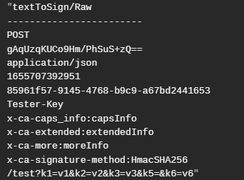

[pic_01]:./resource/signature/pic_01.png
[pic_02]:./resource/signature/pic_02.png
[pic_03]:./resource/signature/pic_03.png
[pic_04]:./resource/signature/pic_04.png
[pic_05]:./resource/signature/pic_05.png
[pic_06]:./resource/signature/pic_06.png
[pic_07]:./resource/signature/pic_07.png
[pic_flow]:./resource/signature/pic_flow.png

# 0. 基本约定
## 0.1 header命名
http中的header字段请统一使用小写与中划线命名。
spring boot 与 postman对http报文的header字段名处理时均将大写+下划线自动转换为小写+中划线形式存储，但网关识别以"x-ca-"开头的拓展首部时不进行自动转换。
由于涉及到客户端与网关两端的转换，为避免出现奇怪的错误，请统一使用小写与中划线命名header字段名；


图 1

相关情况示例参见图 1。

## 0.2 字符编码
http报文字符集编码统一使用utf-8，经MD5、HmacSHA等摘要算法后的字符串使用Base64编码；

## 0.3 适用范围
请求的content-type为：
空, multipart/form-data, application/json, application/x-www-form-urlencoded, application/xml（未测试）

## 0.4 错误码
网关验签抛出错误的错误码统一为10004010；返回状态码为401未授权表示验证失败，返回状态码500服务器内部错误表示计算错误
 
# 1. 签名校验占用的http报文header字段
|   header字段名  |   必须  |	备注  |
|   --------     | -----: |:----:|
|content-md5	|是	|非表单形式body的MD5摘要值；表单形式的body此项应为空|
|content-type	|是	|报文正文的数据形式；一般由框架维护|
|content-length	|是	|报文正文长度，用于判断是否进行body摘要校验；一般由框架维护；|
|nonce	        |是	|随机数；加盐防止重放攻击|
|timestamp	    |是	|时间戳；防止重放攻击，建议精度达秒级或更高|
|app-key	    |是	|用户的唯一身份标示，后端根据它获得对应的app-secret|
|signature	    |是	|签名|
|signature-headers	|是	|计算签名所使用的标准首部以外的拓展首部|
|x-ca-name	|否	|拓展首部；必须以x-ca-开头，此类header参与签名的计算|

上表为签名校验所占用的header字段。
 
# 2. 签名与签名源字符串的计算方法
## 2.1 签名的计算
签名由签名源字符串经过摘要算法（目前固定为HmacSHA256）与编码转换（Base64）得到，签名填入报文header的signature字段，即：
```
request.header.signature = Base64(HmacSHA256(toBeSign));
```
## 2.2 签名源字符串的计算
源串由三部分组成，分别为：标准首部（signHeaders）、拓展首部（signHeaderAddons）、报文参数（signQBs），即：
```
toBeSign = signHeaders + signHeaderAddons + signQBs;
```


图 2

图 2为源串的一个示例，前6行为标准首部，7~10行为拓展首部，第11行为报文参数。
### 2.2.1 标准首部signHeaders
标准首部signHeaders由6个部分拼接而成，依其顺序分别为：
```
signHeaders = method + "\n" 
            + content-md5 + "\n"
            + content-type + "\n"
            + timestamp + "\n"
            + nonce + "\n"
            + appkey + "\n"
```

其中method为请求方法，其余6个部分为报文header中的对应字段值。

请注意：

（1）当标准首部中某一部分为空时，仍应拼接换行符"\n"，如图 3所示。


图 3

图 3为GET请求，报文正文为空，故其content-type与content-md5对应的第2、3行仅有换行符。

### 2.2.2 拓展首部signHeaderAddons
拓展首部均以"x-ca-"开头，用以在报文首部中传输附加信息。拓展首部参与签名的计算，通过签名校验防止篡改。
拓展首部的计算方法为：
```
signHeaderAddons = x-ca-[name-0] + "\n"
                + x-ca-[name-1] + "\n"
                + x-ca-[name-2] + "\n"
                + x-ca-[name-3] + "\n"
                + … …
                + x-ca-[name-n] + "\n"
```
网关不对x-ca-name的顺序作任何形式的规定，name-0, name-1, ... …, name-n的顺序由客户端在报文首部写入的signature-headers的值指明。


图 4

图 4说明了signature-headers与拓展首部的关系。signature-headers的计算方式如下：
```
	signature-headers = x-ca-[name-0] + ","
                    + x-ca-[name-1] + ","
                    + x-ca-[name-2] + ","
                    + x-ca-[name-3] + ","
                    + … …
                    + x-ca-[name-n]
```

### 2.2.3 报文参数signQBs
报文参数由url路径与报文正文表单形式的参数组合而成。图 5最末一行为报文参数的一个示例：


图 5


图 6

图 6为图 5所对应的请求。

报文参数由url路径与参数对(key-value pair)两大部分组成，其中后者又包含了url中所带参数和正文表单参数。
```
signQBs = path + "?" + kvp(url, form) 
```

（1）path为完整url端口号以后、参数标识符"?"以前的部分：
```
http://localhost:8080/test?k1=v1&k2=v2&k6=v6&k5=&k3=v3
->
/test
```

（2）kvp(url, form)的计算：
首先将url中所带的参数和正文表单参数整理成"key=value"的单元——特别地，对于value为空的参数对，须写为"key="的形式（见图 5中key5的情况）；此后对所有"key=value"单元，以key的字典序排序，并且以"&"连接。
```
kvp(url, form) = "key-1=value-1" + ","
			+ "key-2=value-2" + ","
			+ "key-3=value-3" + ","
			+ … …
			+ "key-n=value-n"
```
key-1, key-2, … …, key-n为字典序排序。

（3）分隔符"?"
当kvp为空字符串，即没有任何参数对时，分隔符"?"应省略不写。

### 2.2.4 关于报文正文非表单形式参数的说明
上节中对正文参数的处理仅限于表单形式的数据（仅支持x-www-form-urlencoded形式）。非表单形式的数据（仅支持json）则通过计算正文的MD5摘要并写入报文首部的content-md5字段中的方式参与到签名计算中，即：
```	
content-md5 = base64(md5(serializedObject));
```


图 7

json正文对应serializedObject如图 7所示，保留格式'\n''\t'等格式字符。
 
# 3. 签名检验流程简述


（1）根据header.content-length分为有body校验和无body校验；确实可以通过篡改content-length为0或负数绕过针对body的签名校验，然而这会造成后续解析request发生错误（程序不报错，无法进入控制器），服务仍然是安全的。

（2）针对body的MD5校验和签名校验失败都会抛出错误。错误码为10004010，返回状态码为401未授权，附加信息info会说明错误具体发生的具体位置。

（3）header.content-type == multipart/form-data一般用于文件传输，计算成本较大，此时网关不对body进行MD5校验，客户端不必计算body的MD5。

 
# 4. postman中测试用js脚本
已经生成若干测试请求模板postman collections，核心的pre-request script已根据网关实现调通，供参考。

[pre-request script](./签名资源/servers_api-gateway_resource_signature_gatewayTestScript.js)

[postman collections](./签名资源/gateway-signature-validation.postman_collection.json)

使用时先在local_gw环境下获取登录链接并登录，绕过网关中的token校验，并将网关主程序中的路由转发目的地址改写为测试服务的地址。
